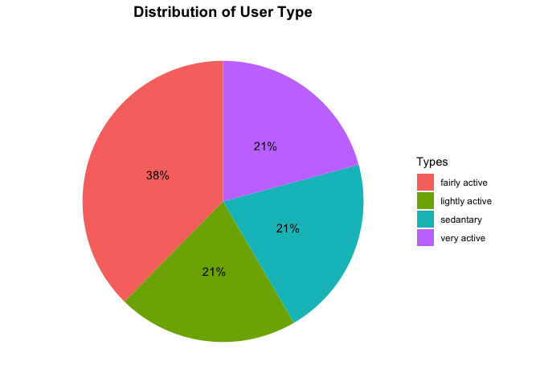
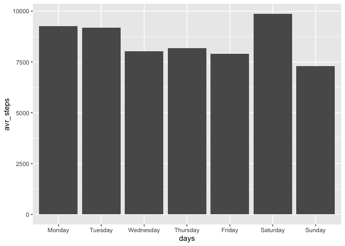
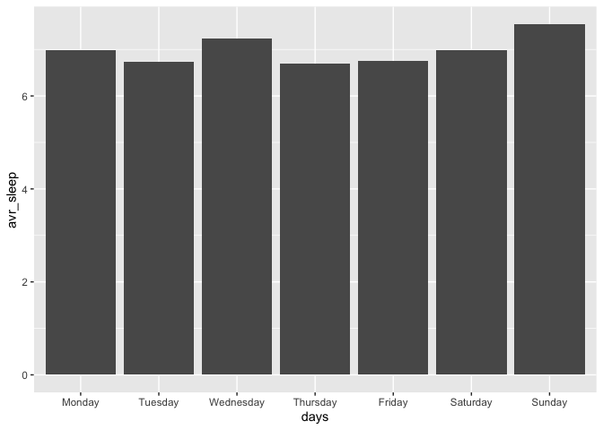
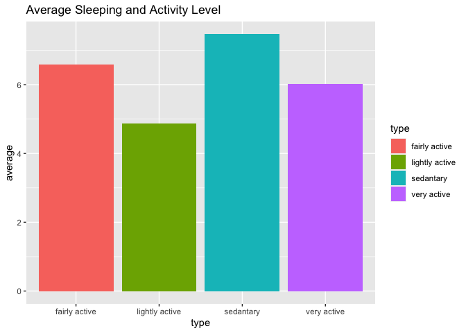
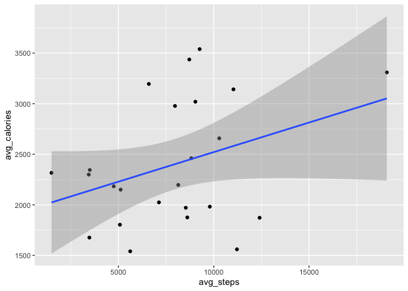
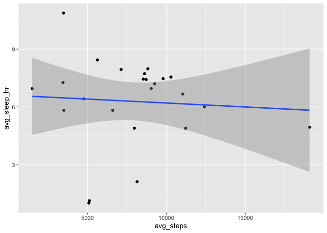
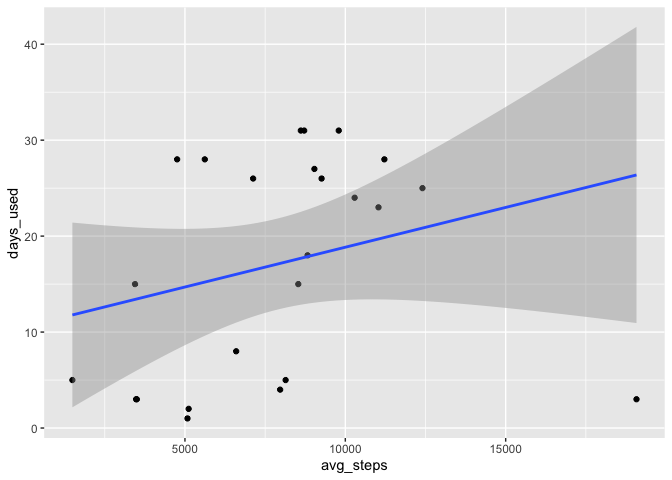

### 1.Summary

Bellabeat is high-tech company which produces smart products for health
tracking use for women. They have different types of devices such as
smart watches, smart bottles and so on which through the company aims to
easen the burden of the daily life by tracking real life data.

For this analysis we are going to focus on one of the companies products
which is Bellabeat App. This app gathers data from Bellabeat products
and have a great potential to improve the users experience of everyday
life.

### 2. Asking Phase

We are using third part data to identify the trends in similar use of
smart devices.

### 3. Preparing Phase

#### 3.1. About Data

We are using FitBit Fitness Tracker Data. The data is stored on Kaggle
and provided by Mobius. It is provided by the owner of the data to the
public use without any demands. The dataset is created by Amazon
Mechanical Turk between 03.12.2016-05.12.2016. Thirty user has consented
to share their data with public.

#### 3.2. Limitations

The dataset that we are using consists of 18 CSV file which covers 30
users daily and hourly activities over two months. As the dataset only
covers 30 users data it might have sampling bias, some tables such as
the one on weight data only contains 8 users data. Therefore we can
conclude that some of the tables are not very helpful in a strong
analysis process. Laslty, the data was collected only in between two
months which is also can be considered as quite limited.

### 4. Processing Phase

For all the steps in this procejt I used R, both for data analysis and
for data visualisation.

#### 4.1 Pacgages Used

For this project beside the base pachage I used these packages:

-   tidyverse
-   lubridate
-   janitor

<!-- -->

    library(tidyverse)
    library(lubridate)
    library(janitor)

#### 4.2. Importing Tables

Since weight and heartrate tables do not cover the majority of the users
I have chosen to work over only the tables covering calorie, step,
activity and sleep data.

    daily_calorie <- read_csv("~/Desktop/google_case_study/Fitabase Data 4.12.16-5.12.16/dailyCalories_merged.csv")

    ## Rows: 940 Columns: 3
    ## ── Column specification ────────────────────────────────────────────────────────
    ## Delimiter: ","
    ## chr (1): ActivityDay
    ## dbl (2): Id, Calories
    ## 
    ## ℹ Use `spec()` to retrieve the full column specification for this data.
    ## ℹ Specify the column types or set `show_col_types = FALSE` to quiet this message.

    daily_activity <- read_csv("~/Desktop/google_case_study/Fitabase Data 4.12.16-5.12.16/dailyActivity_merged.csv")

    ## Rows: 940 Columns: 15
    ## ── Column specification ────────────────────────────────────────────────────────
    ## Delimiter: ","
    ## chr  (1): ActivityDate
    ## dbl (14): Id, TotalSteps, TotalDistance, TrackerDistance, LoggedActivitiesDi...
    ## 
    ## ℹ Use `spec()` to retrieve the full column specification for this data.
    ## ℹ Specify the column types or set `show_col_types = FALSE` to quiet this message.

    daily_step <- read_csv("~/Desktop/google_case_study/Fitabase Data 4.12.16-5.12.16/dailySteps_merged.csv")

    ## Rows: 940 Columns: 3
    ## ── Column specification ────────────────────────────────────────────────────────
    ## Delimiter: ","
    ## chr (1): ActivityDay
    ## dbl (2): Id, StepTotal
    ## 
    ## ℹ Use `spec()` to retrieve the full column specification for this data.
    ## ℹ Specify the column types or set `show_col_types = FALSE` to quiet this message.

    daily_sleep <- read_csv("~/Desktop/google_case_study/Fitabase Data 4.12.16-5.12.16/sleepDay_merged.csv")

    ## Rows: 413 Columns: 5
    ## ── Column specification ────────────────────────────────────────────────────────
    ## Delimiter: ","
    ## chr (1): SleepDay
    ## dbl (4): Id, TotalSleepRecords, TotalMinutesAsleep, TotalTimeInBed
    ## 
    ## ℹ Use `spec()` to retrieve the full column specification for this data.
    ## ℹ Specify the column types or set `show_col_types = FALSE` to quiet this message.

#### 4.3. Previewing The Data Sets

First we should check the data set and skimm the simple summary of each
table.

    head(daily_activity)

    ## # A tibble: 6 × 15
    ##           Id ActivityDate TotalSteps TotalDistance TrackerDistance
    ##        <dbl> <chr>             <dbl>         <dbl>           <dbl>
    ## 1 1503960366 4/12/2016         13162          8.5             8.5 
    ## 2 1503960366 4/13/2016         10735          6.97            6.97
    ## 3 1503960366 4/14/2016         10460          6.74            6.74
    ## 4 1503960366 4/15/2016          9762          6.28            6.28
    ## 5 1503960366 4/16/2016         12669          8.16            8.16
    ## 6 1503960366 4/17/2016          9705          6.48            6.48
    ## # ℹ 10 more variables: LoggedActivitiesDistance <dbl>,
    ## #   VeryActiveDistance <dbl>, ModeratelyActiveDistance <dbl>,
    ## #   LightActiveDistance <dbl>, SedentaryActiveDistance <dbl>,
    ## #   VeryActiveMinutes <dbl>, FairlyActiveMinutes <dbl>,
    ## #   LightlyActiveMinutes <dbl>, SedentaryMinutes <dbl>, Calories <dbl>

    str(daily_activity)

    ## spc_tbl_ [940 × 15] (S3: spec_tbl_df/tbl_df/tbl/data.frame)
    ##  $ Id                      : num [1:940] 1.5e+09 1.5e+09 1.5e+09 1.5e+09 1.5e+09 ...
    ##  $ ActivityDate            : chr [1:940] "4/12/2016" "4/13/2016" "4/14/2016" "4/15/2016" ...
    ##  $ TotalSteps              : num [1:940] 13162 10735 10460 9762 12669 ...
    ##  $ TotalDistance           : num [1:940] 8.5 6.97 6.74 6.28 8.16 ...
    ##  $ TrackerDistance         : num [1:940] 8.5 6.97 6.74 6.28 8.16 ...
    ##  $ LoggedActivitiesDistance: num [1:940] 0 0 0 0 0 0 0 0 0 0 ...
    ##  $ VeryActiveDistance      : num [1:940] 1.88 1.57 2.44 2.14 2.71 ...
    ##  $ ModeratelyActiveDistance: num [1:940] 0.55 0.69 0.4 1.26 0.41 ...
    ##  $ LightActiveDistance     : num [1:940] 6.06 4.71 3.91 2.83 5.04 ...
    ##  $ SedentaryActiveDistance : num [1:940] 0 0 0 0 0 0 0 0 0 0 ...
    ##  $ VeryActiveMinutes       : num [1:940] 25 21 30 29 36 38 42 50 28 19 ...
    ##  $ FairlyActiveMinutes     : num [1:940] 13 19 11 34 10 20 16 31 12 8 ...
    ##  $ LightlyActiveMinutes    : num [1:940] 328 217 181 209 221 164 233 264 205 211 ...
    ##  $ SedentaryMinutes        : num [1:940] 728 776 1218 726 773 ...
    ##  $ Calories                : num [1:940] 1985 1797 1776 1745 1863 ...
    ##  - attr(*, "spec")=
    ##   .. cols(
    ##   ..   Id = col_double(),
    ##   ..   ActivityDate = col_character(),
    ##   ..   TotalSteps = col_double(),
    ##   ..   TotalDistance = col_double(),
    ##   ..   TrackerDistance = col_double(),
    ##   ..   LoggedActivitiesDistance = col_double(),
    ##   ..   VeryActiveDistance = col_double(),
    ##   ..   ModeratelyActiveDistance = col_double(),
    ##   ..   LightActiveDistance = col_double(),
    ##   ..   SedentaryActiveDistance = col_double(),
    ##   ..   VeryActiveMinutes = col_double(),
    ##   ..   FairlyActiveMinutes = col_double(),
    ##   ..   LightlyActiveMinutes = col_double(),
    ##   ..   SedentaryMinutes = col_double(),
    ##   ..   Calories = col_double()
    ##   .. )
    ##  - attr(*, "problems")=<externalptr>

    head(daily_calorie)

    ## # A tibble: 6 × 3
    ##           Id ActivityDay Calories
    ##        <dbl> <chr>          <dbl>
    ## 1 1503960366 4/12/2016       1985
    ## 2 1503960366 4/13/2016       1797
    ## 3 1503960366 4/14/2016       1776
    ## 4 1503960366 4/15/2016       1745
    ## 5 1503960366 4/16/2016       1863
    ## 6 1503960366 4/17/2016       1728

    str(daily_calorie)

    ## spc_tbl_ [940 × 3] (S3: spec_tbl_df/tbl_df/tbl/data.frame)
    ##  $ Id         : num [1:940] 1.5e+09 1.5e+09 1.5e+09 1.5e+09 1.5e+09 ...
    ##  $ ActivityDay: chr [1:940] "4/12/2016" "4/13/2016" "4/14/2016" "4/15/2016" ...
    ##  $ Calories   : num [1:940] 1985 1797 1776 1745 1863 ...
    ##  - attr(*, "spec")=
    ##   .. cols(
    ##   ..   Id = col_double(),
    ##   ..   ActivityDay = col_character(),
    ##   ..   Calories = col_double()
    ##   .. )
    ##  - attr(*, "problems")=<externalptr>

    head(daily_sleep)

    ## # A tibble: 6 × 5
    ##           Id SleepDay        TotalSleepRecords TotalMinutesAsleep TotalTimeInBed
    ##        <dbl> <chr>                       <dbl>              <dbl>          <dbl>
    ## 1 1503960366 4/12/2016 12:0…                 1                327            346
    ## 2 1503960366 4/13/2016 12:0…                 2                384            407
    ## 3 1503960366 4/15/2016 12:0…                 1                412            442
    ## 4 1503960366 4/16/2016 12:0…                 2                340            367
    ## 5 1503960366 4/17/2016 12:0…                 1                700            712
    ## 6 1503960366 4/19/2016 12:0…                 1                304            320

    str(daily_sleep)

    ## spc_tbl_ [413 × 5] (S3: spec_tbl_df/tbl_df/tbl/data.frame)
    ##  $ Id                : num [1:413] 1.5e+09 1.5e+09 1.5e+09 1.5e+09 1.5e+09 ...
    ##  $ SleepDay          : chr [1:413] "4/12/2016 12:00:00 AM" "4/13/2016 12:00:00 AM" "4/15/2016 12:00:00 AM" "4/16/2016 12:00:00 AM" ...
    ##  $ TotalSleepRecords : num [1:413] 1 2 1 2 1 1 1 1 1 1 ...
    ##  $ TotalMinutesAsleep: num [1:413] 327 384 412 340 700 304 360 325 361 430 ...
    ##  $ TotalTimeInBed    : num [1:413] 346 407 442 367 712 320 377 364 384 449 ...
    ##  - attr(*, "spec")=
    ##   .. cols(
    ##   ..   Id = col_double(),
    ##   ..   SleepDay = col_character(),
    ##   ..   TotalSleepRecords = col_double(),
    ##   ..   TotalMinutesAsleep = col_double(),
    ##   ..   TotalTimeInBed = col_double()
    ##   .. )
    ##  - attr(*, "problems")=<externalptr>

    head(daily_step)

    ## # A tibble: 6 × 3
    ##           Id ActivityDay StepTotal
    ##        <dbl> <chr>           <dbl>
    ## 1 1503960366 4/12/2016       13162
    ## 2 1503960366 4/13/2016       10735
    ## 3 1503960366 4/14/2016       10460
    ## 4 1503960366 4/15/2016        9762
    ## 5 1503960366 4/16/2016       12669
    ## 6 1503960366 4/17/2016        9705

    str(daily_step) 

    ## spc_tbl_ [940 × 3] (S3: spec_tbl_df/tbl_df/tbl/data.frame)
    ##  $ Id         : num [1:940] 1.5e+09 1.5e+09 1.5e+09 1.5e+09 1.5e+09 ...
    ##  $ ActivityDay: chr [1:940] "4/12/2016" "4/13/2016" "4/14/2016" "4/15/2016" ...
    ##  $ StepTotal  : num [1:940] 13162 10735 10460 9762 12669 ...
    ##  - attr(*, "spec")=
    ##   .. cols(
    ##   ..   Id = col_double(),
    ##   ..   ActivityDay = col_character(),
    ##   ..   StepTotal = col_double()
    ##   .. )
    ##  - attr(*, "problems")=<externalptr>

#### 4.4. Data Wrangling

For this step I inspected the data thoroughly and checked for
duplicates, data types, missing datas, date data, number of users. Then
I re-adjusted the column names.

##### 4.4.1. Number of Users

Before proceeding for the rest of the analysis we should check the
number of users we have in our data because in the end we are going to
merge the entire four table for the rest of the analysis.

    n_distinct(daily_activity$Id)

    ## [1] 33

    n_distinct(daily_sleep$Id)

    ## [1] 24

    n_distinct(daily_step$Id)

    ## [1] 33

    n_distinct(daily_calorie$Id)

    ## [1] 33

As it is seen except for the sleep data we have 33 distinct users.

##### 4.4.2. Duplicate and N/A Data Points

In order to have valid results to a certain degree we must delete the
duplicate points. Missing data can be handeled within big datasets,
however, since we have small dataset we should avoid using it as well.

    sum(duplicated(daily_activity))

    ## [1] 0

    sum(duplicated(daily_calorie))

    ## [1] 0

    sum(duplicated(daily_step))

    ## [1] 0

    sum(duplicated(daily_sleep))

    ## [1] 3

It looks like we only have 3 duplicates in sleep table. As we are going
to remove all the duplicates and missing data we can write a simple
function to do all these for us. I will add this function into a one
final function, this is just for showing purposes.

    data_fiixer <- function(data) {
      # remove the missing data
      data <- na.omit(data)
      
      # remove the duplicates
      data <- distinct(data)
      
      return(data)
    }

##### 4.4.3. Cleaning Names and Rename Columns

For the sake of the analysis we should standardize the names and the
columns so the for the analysis phase we can increase the comfort.

As we are going to apply the same process for all the tables we can
write another function to ease and fasten our job. For this we can write
a total function which can handle both the renaming and time adjusting
tasks.

##### 4.4.4. Consistency of Time Frame

We are going to merge all the data based on both Id and Time data
therefore we require our data to be consistent in both cases.

We can again write a function to secure the consistency of our data. To
fasten the process I have joined all the functions together. Which is
better in terms of time control and ram and cpu usage as well.

      #As Sleep table includes hours and seconds which we do not need for this analysis we should fix it first.
    daily_sleep$SleepDay <- substr(daily_sleep$SleepDay, 1, regexpr(" ", daily_sleep$SleepDay) - 1)

    data_fixer <- function(data) {
      
      # Remove duplicates and missing data
      data <- data %>%
        distinct() %>%
        drop_na()
      
      # Cleaning Names
      clean_names(data)
      
      # Renaming Columns
      data <- rename_with(data, tolower)
      
      # All the time data is stored in the second column. The name of the second column
      col_name <- colnames(data)[2]
      
      # Rename and Mutate the Time Data
      data <- data %>% 
        rename(date = col_name) %>% 
        mutate(date = as_date(date, format = "%m/%d/%Y"))
      
      return(data)
    }

    daily_activity <- data_fixer(daily_activity)

    ## Warning: Using an external vector in selections was deprecated in tidyselect 1.1.0.
    ## ℹ Please use `all_of()` or `any_of()` instead.
    ##   # Was:
    ##   data %>% select(col_name)
    ## 
    ##   # Now:
    ##   data %>% select(all_of(col_name))
    ## 
    ## See <https://tidyselect.r-lib.org/reference/faq-external-vector.html>.
    ## This warning is displayed once every 8 hours.
    ## Call `lifecycle::last_lifecycle_warnings()` to see where this warning was
    ## generated.

    daily_calorie <- data_fixer(daily_calorie)
    daily_sleep <- data_fixer(daily_sleep)
    daily_step <- data_fixer(daily_step)

Before we join the datasets lets have look at them to soo if there is
any problem.

    glimpse(c(daily_activity, daily_calorie, daily_sleep, daily_step))

    ## List of 26
    ##  $ id                      : num [1:940] 1.5e+09 1.5e+09 1.5e+09 1.5e+09 1.5e+09 ...
    ##  $ date                    : Date[1:940], format: "2016-04-12" "2016-04-13" ...
    ##  $ totalsteps              : num [1:940] 13162 10735 10460 9762 12669 ...
    ##  $ totaldistance           : num [1:940] 8.5 6.97 6.74 6.28 8.16 ...
    ##  $ trackerdistance         : num [1:940] 8.5 6.97 6.74 6.28 8.16 ...
    ##  $ loggedactivitiesdistance: num [1:940] 0 0 0 0 0 0 0 0 0 0 ...
    ##  $ veryactivedistance      : num [1:940] 1.88 1.57 2.44 2.14 2.71 ...
    ##  $ moderatelyactivedistance: num [1:940] 0.55 0.69 0.4 1.26 0.41 ...
    ##  $ lightactivedistance     : num [1:940] 6.06 4.71 3.91 2.83 5.04 ...
    ##  $ sedentaryactivedistance : num [1:940] 0 0 0 0 0 0 0 0 0 0 ...
    ##  $ veryactiveminutes       : num [1:940] 25 21 30 29 36 38 42 50 28 19 ...
    ##  $ fairlyactiveminutes     : num [1:940] 13 19 11 34 10 20 16 31 12 8 ...
    ##  $ lightlyactiveminutes    : num [1:940] 328 217 181 209 221 164 233 264 205 211 ...
    ##  $ sedentaryminutes        : num [1:940] 728 776 1218 726 773 ...
    ##  $ calories                : num [1:940] 1985 1797 1776 1745 1863 ...
    ##  $ id                      : num [1:940] 1.5e+09 1.5e+09 1.5e+09 1.5e+09 1.5e+09 ...
    ##  $ date                    : Date[1:940], format: "2016-04-12" "2016-04-13" ...
    ##  $ calories                : num [1:940] 1985 1797 1776 1745 1863 ...
    ##  $ id                      : num [1:410] 1.5e+09 1.5e+09 1.5e+09 1.5e+09 1.5e+09 ...
    ##  $ date                    : Date[1:410], format: "2016-04-12" "2016-04-13" ...
    ##  $ totalsleeprecords       : num [1:410] 1 2 1 2 1 1 1 1 1 1 ...
    ##  $ totalminutesasleep      : num [1:410] 327 384 412 340 700 304 360 325 361 430 ...
    ##  $ totaltimeinbed          : num [1:410] 346 407 442 367 712 320 377 364 384 449 ...
    ##  $ id                      : num [1:940] 1.5e+09 1.5e+09 1.5e+09 1.5e+09 1.5e+09 ...
    ##  $ date                    : Date[1:940], format: "2016-04-12" "2016-04-13" ...
    ##  $ steptotal               : num [1:940] 13162 10735 10460 9762 12669 ...

It looks fine, so we can proceed for the next phase. However, it looks
like we already have the calorie information in activity table as we do
not need the daily\_calories table we can leave it out.

#### 4.4.5. Joining Datasets

We are going to merge daily\_activity, daily\_calories and daily\_sleep
data by the id and the date variables. The aim of this move is to be
able to look for relationship between the variables.

    fitbit_merged <- daily_activity %>% 
      left_join(daily_sleep, by=c("id", "date")) %>% 
      drop_na()

    glimpse(fitbit_merged)

    ## Rows: 410
    ## Columns: 18
    ## $ id                       <dbl> 1503960366, 1503960366, 1503960366, 150396036…
    ## $ date                     <date> 2016-04-12, 2016-04-13, 2016-04-15, 2016-04-…
    ## $ totalsteps               <dbl> 13162, 10735, 9762, 12669, 9705, 15506, 10544…
    ## $ totaldistance            <dbl> 8.50, 6.97, 6.28, 8.16, 6.48, 9.88, 6.68, 6.3…
    ## $ trackerdistance          <dbl> 8.50, 6.97, 6.28, 8.16, 6.48, 9.88, 6.68, 6.3…
    ## $ loggedactivitiesdistance <dbl> 0, 0, 0, 0, 0, 0, 0, 0, 0, 0, 0, 0, 0, 0, 0, …
    ## $ veryactivedistance       <dbl> 1.88, 1.57, 2.14, 2.71, 3.19, 3.53, 1.96, 1.3…
    ## $ moderatelyactivedistance <dbl> 0.55, 0.69, 1.26, 0.41, 0.78, 1.32, 0.48, 0.3…
    ## $ lightactivedistance      <dbl> 6.06, 4.71, 2.83, 5.04, 2.51, 5.03, 4.24, 4.6…
    ## $ sedentaryactivedistance  <dbl> 0, 0, 0, 0, 0, 0, 0, 0, 0, 0, 0, 0, 0, 0, 0, …
    ## $ veryactiveminutes        <dbl> 25, 21, 29, 36, 38, 50, 28, 19, 41, 39, 73, 3…
    ## $ fairlyactiveminutes      <dbl> 13, 19, 34, 10, 20, 31, 12, 8, 21, 5, 14, 23,…
    ## $ lightlyactiveminutes     <dbl> 328, 217, 209, 221, 164, 264, 205, 211, 262, …
    ## $ sedentaryminutes         <dbl> 728, 776, 726, 773, 539, 775, 818, 838, 732, …
    ## $ calories                 <dbl> 1985, 1797, 1745, 1863, 1728, 2035, 1786, 177…
    ## $ totalsleeprecords        <dbl> 1, 2, 1, 2, 1, 1, 1, 1, 1, 1, 1, 1, 1, 1, 1, …
    ## $ totalminutesasleep       <dbl> 327, 384, 412, 340, 700, 304, 360, 325, 361, …
    ## $ totaltimeinbed           <dbl> 346, 407, 442, 367, 712, 320, 377, 364, 384, …

The reason why we used drop\_na() function again is because after using
left\_join() function R adds the second table to the first one, as the
number of users does not match in both table there happens to be some
missing data points. Due to my needs for activity data to be on the
beginning of the table I decided to write the code in this way,
otherwise we could have just changed the order of the tables, meaning we
could have written the code in this way:

    # fitbit_merged <- daily_sleep %>% 
    #  left_join(daily_activity, by=c("id", "date"))

### 5. Analyzing and Sharing Phase

We will conduct the analysis of the tables to determine the trends and
decide if the results can lead to a profitable decisions.

#### 5.1. Seperating the Users into Groups by Their Activity Level

Since the demographic data which could have been useful during the
analysis is not reachable we need a standing point for the rest of the
analysis. For that we can use the number of steps taken every day.

    *Sedentary - Less than 5000 steps a day.
    *Lightly active - Between 5000 and 7499 steps a day.
    *Fairly active - Between 7500 and 9999 steps a day.
    *Very active - More than 10000 steps a day.

This classification was made based on the article on this
[link](https://www.10000steps.org.au/articles/counting-steps/).

Following this we need the daily avarage of each users:

    avarage_steps <- fitbit_merged %>% 
      group_by(id) %>% 
      summarize(avg_steps = mean(totalsteps), avg_calories = mean(calories), avg_sleep_hr = mean(totalminutesasleep/60))

    head(avarage_steps)

    ## # A tibble: 6 × 4
    ##           id avg_steps avg_calories avg_sleep_hr
    ##        <dbl>     <dbl>        <dbl>        <dbl>
    ## 1 1503960366    12406.        1872.         6.00
    ## 2 1644430081     7968.        2978.         4.9 
    ## 3 1844505072     3477         1676.        10.9 
    ## 4 1927972279     1490         2316.         6.95
    ## 5 2026352035     5619.        1541.         8.44
    ## 6 2320127002     5079         1804          1.02

Based on this table now we can classify our users:

    user_class <- avarage_steps %>% 
      mutate(type = case_when(
        avg_steps < 5000 ~ "sedantary",
        avg_steps >= 5000 & avg_steps <= 7499 ~ "lightly active",
        avg_steps >- 7500 & avg_steps <= 9999 ~ "fairly active",
        avg_steps >= 10000 ~ "very active"
      ))

    head(user_class)

    ## # A tibble: 6 × 5
    ##           id avg_steps avg_calories avg_sleep_hr type          
    ##        <dbl>     <dbl>        <dbl>        <dbl> <chr>         
    ## 1 1503960366    12406.        1872.         6.00 very active   
    ## 2 1644430081     7968.        2978.         4.9  fairly active 
    ## 3 1844505072     3477         1676.        10.9  sedantary     
    ## 4 1927972279     1490         2316.         6.95 sedantary     
    ## 5 2026352035     5619.        1541.         8.44 lightly active
    ## 6 2320127002     5079         1804          1.02 lightly active

We can easily show the percentage of each user type with a simple data
visualisation in a pie chart. First lets calculate the percentage of
each user type and save it within a table.

    user_class_p <- user_class %>% 
      group_by(type) %>% 
      summarise(total = n()) %>% 
      mutate(percentage = ceiling((total / sum(total))*100))

    head(user_class_p)

    ## # A tibble: 4 × 3
    ##   type           total percentage
    ##   <chr>          <int>      <dbl>
    ## 1 fairly active      9         38
    ## 2 lightly active     5         21
    ## 3 sedantary          5         21
    ## 4 very active        5         21

As you can see the users are distributed by their activities. the total
percentage makes up to it is because we ceiled the percentages to make
working with them easier. The data shows that there is a relationship
between the usage of the app and the type of users. *Devices are more
popular among fairly active users.*

We can see this by creating a pie chart:

    user_class_p %>% 
      ggplot(mapping = aes(x="", y = percentage, fill = type)) +
      geom_bar(stat = "identity", width = 1) +
      coord_polar(theta = "y") + # This converts the bar chart to a pie chart
      labs(title = "Distribution of User Type", fill = "Types") +
      theme_minimal() +
      theme(axis.title.x= element_blank(),
            axis.title.y = element_blank(),
            panel.border = element_blank(), 
            panel.grid = element_blank(), 
            axis.ticks = element_blank(),
            axis.text.x = element_blank(),
            plot.title = element_text(hjust = 0.5, size=14, face = "bold")) +
      geom_text(aes(label = paste0(percentage,"%")),
                position = position_stack(vjust = 0.5))

    ggsave(filename = paste0("~/Desktop/google_case_study/visuals/", "dist_of_users.png"))

    ## Saving 7 x 5 in image

#### 5.2. Sleeping and Stepping Data

Before we start to look for some results aiming for a relation we should
inspect the sleeping and stepping distribution throughout the week.

    weekly_step_sleep <- fitbit_merged %>%
      mutate(days = weekdays(date))

    weekly_step_sleep$days <- ordered(weekly_step_sleep$days, levels=c("Monday", "Tuesday", "Wednesday", "Thursday","Friday", "Saturday", "Sunday"))

    weekly_step_sleep <- weekly_step_sleep %>% 
      group_by(days) %>% 
      summarise(avr_steps = mean(totalsteps), avr_sleep = mean(totalminutesasleep/60))

    head(weekly_step_sleep)

    ## # A tibble: 6 × 3
    ##   days      avr_steps avr_sleep
    ##   <ord>         <dbl>     <dbl>
    ## 1 Monday        9273.      6.99
    ## 2 Tuesday       9183.      6.74
    ## 3 Wednesday     8023.      7.24
    ## 4 Thursday      8184.      6.69
    ## 5 Friday        7901.      6.76
    ## 6 Saturday      9871.      6.98

Based on this data now we can see the average steps and sleeping hours
on a bar chart.

    ggplot(data=weekly_step_sleep, mapping = aes(x=days, y=avr_steps)) +
      geom_bar(stat="identity")

    ggplot(data=weekly_step_sleep, mapping = aes(x=days, y=avr_sleep)) +
      geom_bar(stat="identity")

 The
above tabels shows that while the users are walking the recommended
amount everyday except for sunday they do not sleep the recommended
amount of hours which is eight hours.

#### 5.3. Avarage Sleeping Hours and Activity Level

Sleeping is an important part of our lives and and it has a huge impact
on both activity and energy. It is needed to be checked.

    sleep_type <- user_class %>% 
      group_by(type) %>% 
      summarise(average = mean(avg_sleep_hr))

    head(sleep_type)

    ## # A tibble: 4 × 2
    ##   type           average
    ##   <chr>            <dbl>
    ## 1 fairly active     6.58
    ## 2 lightly active    4.87
    ## 3 sedantary         7.47
    ## 4 very active       6.01

Here we can summarize it with a bar chart.

    sleep_type %>%
      ggplot(mapping = aes(x = type, y = average, fill = type)) +
      geom_bar(stat = "identity") +
      labs(title = "Average Sleeping and Activity Level")

    ggsave(filename = paste0("~/Desktop/google_case_study/visuals/", "sleep_and_type.png"))

    ## Saving 7 x 5 in image

As it can be seen through the table as well, while lightly active users
are sleeping less and sedantary active users are sleeping the most, very
and fairly active users are sleeping in between desirable hour values.

#### 5.4. Correlations

We are going to check the correlations between:

-   Steps and calories burned
-   Steps and sleeping hours
-   Activity level and app usage

For this, first we should calculate the app usage values first and add
it to the user\_class table.

    user_class <- user_class %>% 
      left_join(fitbit_merged %>% 
                  group_by(id) %>% 
                  summarise(days_used=sum(n())) %>% 
                  mutate(usage = case_when(
                    days_used >= 1 & days_used <= 10 ~ "low use",
                    days_used >= 11 & days_used <= 20 ~ "moderate use", 
                    days_used >= 21 & days_used <= 31 ~ "high use", 
                  )))

    ## Joining with `by = join_by(id)`

    head(user_class)

    ## # A tibble: 6 × 7
    ##           id avg_steps avg_calories avg_sleep_hr type           days_used usage 
    ##        <dbl>     <dbl>        <dbl>        <dbl> <chr>              <int> <chr> 
    ## 1 1503960366    12406.        1872.         6.00 very active           25 high …
    ## 2 1644430081     7968.        2978.         4.9  fairly active          4 low u…
    ## 3 1844505072     3477         1676.        10.9  sedantary              3 low u…
    ## 4 1927972279     1490         2316.         6.95 sedantary              5 low u…
    ## 5 2026352035     5619.        1541.         8.44 lightly active        28 high …
    ## 6 2320127002     5079         1804          1.02 lightly active         1 low u…

Now we have activity and app usage columns with average sleeping,
walking and burned calories data all together on one table, we can
conclude through the analysis of this table.

    cor_steps_cal <- cor(user_class$avg_steps, user_class$avg_calories)
    cor_steps_slp <- cor(user_class$avg_steps, user_class$avg_sleep_hr)
    cor_type_use <- cor(user_class$avg_steps, user_class$days_used)

    cor_steps_cal

    ## [1] 0.3508721

    cor_steps_slp

    ## [1] -0.06633235

    cor_type_use

    ## [1] 0.2693288

As the correlation analysis shows there is a moderately week positive
relationship (0.35) between steps taken and calories burned. This might
be a mistake, therefore this must be considered as an important outcome
where the developers must take a second look.

    user_class %>% 
      ggplot(mapping = aes(x=avg_steps, y=avg_calories)) +
      geom_point() +
      geom_smooth(method = "lm")

    ## `geom_smooth()` using formula = 'y ~ x'

For the steps taken and sleeping hours there is a strong negative
relationship (-0.66) where the number of steps are increasing there is a
decrease in sleeping hours.

    user_class %>% 
      ggplot(mapping = aes(x=avg_steps, y=avg_sleep_hr)) +
      geom_point() +
      geom_smooth(method = "lm")

    ## `geom_smooth()` using formula = 'y ~ x'

Last but not least there is a moderately week positive relationship
(0,27) between the actity level and app usage, yet it is not a sufficent
data for creating a data driven business decision.

    user_class %>% 
      ggplot(mapping = aes(x=avg_steps, y=days_used)) +
      geom_point() +
      geom_smooth(method= "lm")

 Now the
previous phases are done we can continue with the conclusion.

### 6. Conclusion

Bellabeat’s aim is to empower women by increasing the daily life
experience through their smart devices.

As for this case study it can be said that the dataset was not
sufficient enough for an overall analysis. The dataset includes 33 users
data, however, when we clear the dataset and finally merge them together
the remaining dataset consists of only 24 users data. My first and most
useful insight would be to come up with bigger data and also it’s
covering an entire year might be also quite usefull for answering
business related questions.

The foremost result of my analysis is showing that the people who uses
the app more frequently are showing better results in daily activity,
calories burned and sleeping hours. Therefore the main point to be
worked on must be over increasing the average app usage.

For this we might apply: \* Giving feedback for activities on a daily,
weekly and monthly basis. \* Sending notifications over recommended and
aimed activities. \* Creating a competing environment might motivate the
users. \* Making the app more fun.
